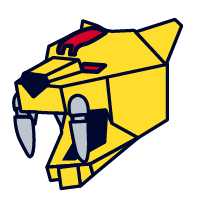

#  microzord

## Attention: WIP

It is a pre-alpha version of the library. Please, do not use it until official release.

[](https://npmjs.com/package/@microzord/core)
[](https://bundlephobia.com/result?p=@microzord/core)

## What is it?

It is a small tool that allows you to add and render multiple apps on one page. It has simple ideomatic APIs for all modern frameworks and builds bridges between them.

🧙 **Framework agnostic**. You can have an Angular application with a React app header and a Vue app footer. Each app can have endless amount of nested apps inside. There are also wrappers for every modern framework with simple API.

🧩 **Modular**. You can insert another app in your app in any place as an ordinary component. Use the same methods to bind data and to handle its events.

🐝 **Tiny as a bee and works as well**. No new code in the bundle of child application and a bit more than 1 KB library for host application to get all the benefits!

## Installation and usage

An extensive demo is coming soon...

### An example of usage external apps in Angular app

app.module.ts

```ts
@NgModule({
  imports: [
    MicrozordHostModule.register({
      apps: [
        {
          name: 'react-menu',
          assetMap: '/react-menu/microzord.json',
        },
        {
          name: 'vue-footer-app',
          assetMap: '/vue-footer-app/microzord.json',
        },
      ],
    }),
  ],
})
export class AppModule {}
```

Usage in application:

```html
<header microzord="react-menu"></header>

<div>Any content</div>

<footer microzord="vue-footer-app" (hook)="onFooterLifecycleEvent($event)"></footer>
```

## Core team

<table>
    <tr>
       <td align="center">
            <a href="https://twitter.com/katsuba_igor"
                ><br /><sub><b>Igor Katsuba</b></sub></a
            >
            <div style="margin-top: 4px">
                <a
                    href="https://twitter.com/katsuba_igor"
                    title="Twitter"
                    ></a>
                <a href="https://github.com/IKatsuba" title="Github"
                    ></a>
                <a
                    href="https://t.me/Katsuba"
                    title="Telegram"
                    ></a>
            </div>
        </td>
        <td align="center">
            <a href="http://marsibarsi.me"
                ><br /><b>Roman Sedov</b></a
            >
            <div style="margin-top: 4px">
                <a
                    href="https://twitter.com/marsibarsi"
                    title="Twitter"
                    ></a>
                <a
                    href="https://github.com/marsibarsi"
                    title="GitHub"
                    ></a>
                <a
                    href="https://t.me/marsibarsi"
                    title="Telegram"
                    ></a>
            </div>
        </td>
    </tr>

</table>

## License

🆓 Feel free to use our library in your commercial and private applications

All microzord packages are covered by [Apache 2.0](/LICENSE)

Read more about this license [here](https://choosealicense.com/licenses/apache-2.0/)
